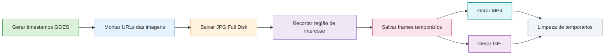

# 🌎 GOES-19 Region Timelapse Crop

<div align="center">


</div>

---

> 📘 **Sobre este projeto**  
> Ferramenta em Python para baixar imagens históricas do satélite geoestacionário **GOES-19**, recortar automaticamente uma região de interesse e gerar um **MP4** e/ou **GIF** com a sequência temporal resultante.  
> O foco atual está em imagens **GEOCOLOR Full Disk** em alta resolução, com pipeline organizado, suporte opcional a **RAM disk**, encode via **FFmpeg** e uso preferencial de **HEVC NVENC** quando disponível.

---

## 🧾 TL;DR

Este projeto:

- baixa imagens históricas do **GOES-19** em alta resolução;
- seleciona uma região específica da imagem completa;
- gera frames recortados de forma sequencial;
- monta um **vídeo MP4** e opcionalmente um **GIF**;
- pode usar **RAM disk** para reduzir escrita temporária no SSD;
- já possui base para evolução de estatísticas, telemetria e desligamento controlado.

---

## ⚠️ Comece por aqui

Se você só quer usar o projeto no estado atual:

1. clone o repositório;
2. instale as dependências Python;
3. instale o **FFmpeg**;
4. rode `python main.py`.

### Observação importante
O projeto já funciona diretamente baixando as imagens do servidor NOAA/STAR.  
Já o script `regions_debug.py` é uma ferramenta auxiliar, usada para **descobrir e validar coordenadas de recorte** em uma imagem completa já baixada localmente.

Neste momento, para usar `regions_debug.py`, é necessário:

- baixar manualmente uma imagem Full Disk completa;
- ajustar o caminho da imagem no arquivo para algo como `sua-imagem.png` ou `sua-imagem.jpg`;
- executar o script isoladamente.

Exemplo de imagem completa que pode ser baixada para debug de região:

```text
https://cdn.star.nesdis.noaa.gov/GOES19/ABI/FD/GEOCOLOR/20261231850_GOES19-ABI-FD-GEOCOLOR-21696x21696.jpg
```

---

## 📋 Sumário

1. [Sobre o projeto](#-sobre-o-projeto)
2. [Motivação](#-motivação)
3. [Principais funcionalidades](#-principais-funcionalidades)
4. [Fluxo de trabalho](#-fluxo-de-trabalho-pipeline)
5. [Estrutura do repositório](#-estrutura-do-repositório)
6. [Requisitos](#-requisitos)
7. [Instalação](#-instalação)
8. [Como usar](#-como-usar)
9. [Regiões e ajuste de coordenadas](#-regiões-e-ajuste-de-coordenadas)
10. [RAM disk](#-ram-disk)
11. [Saídas geradas](#-saídas-geradas)
12. [Troubleshooting](#-troubleshooting)
13. [Roadmap / futuras atualizações](#-roadmap--futuras-atualizações)
14. [Licença](#-licença)

---

## 📖 Sobre o projeto

O projeto foi desenvolvido para automatizar um fluxo que, manualmente, seria bastante repetitivo:

1. identificar timestamps válidos do GOES;
2. baixar imagens grandes do produto Full Disk;
3. recortar uma área geográfica de interesse;
4. organizar os frames;
5. gerar uma animação final.

A proposta não é apenas “baixar uma imagem”, mas construir um pipeline reutilizável e extensível para **timelapse regional a partir de imagens geoestacionárias**.

---

## 🎯 Motivação

A motivação central do projeto é permitir observar a evolução temporal de uma região específica — por exemplo, o **Sudeste do Brasil** — sem precisar trabalhar manualmente com imagens Full Disk inteiras a cada novo experimento.

Na prática, isso permite:

- acompanhar nuvens e padrões atmosféricos em uma janela de tempo definida;
- gerar vídeos compactos e fáceis de visualizar;
- reduzir trabalho manual de edição;
- preservar o SSD ao usar armazenamento temporário em RAM quando desejado;
- manter o pipeline organizado para evolução futura.

---

## ✨ Principais funcionalidades

### Já implementado
- Download histórico de imagens GOES-19 Full Disk GEOCOLOR
- Geração automática de lista temporal com passo fixo de 10 minutos
- Recorte por coordenadas de região definidas em `regions.py`
- Encode final em **MP4**
- Geração opcional de **GIF**
- Preferência por **HEVC NVENC** quando disponível
- Fallback para encode por CPU
- Suporte opcional a **RAM disk** para temporários
- Limpeza de artefatos efêmeros ao final
- Estrutura modular do projeto

### Em evolução
- Encerramento controlado com `CTRL+C`
- Estatísticas de download e tempo de crop mais detalhadas
- Telemetria mais clara durante a execução

---

## 🛠️ Fluxo de trabalho (Pipeline)



---

## 📁 Estrutura do repositório

```bash
timelapse_crop/
├── config.py
├── cropper.py
├── encoder.py
├── goes_client.py
├── main.py
├── paths.py
├── pipeline.py
├── ramdisk.py
├── regions.py
├── regions_debug.py
├── requirements.txt
├── README.md
└── .gitignore
```

### Papel de cada arquivo

- `main.py`  
  Ponto de entrada da aplicação e interface de linha de comando.

- `config.py`  
  Configuração central do projeto: região, encode, RAM disk, GIF, janela temporal etc.

- `goes_client.py`  
  Construção de URLs, geração dos timestamps e download das imagens.

- `cropper.py`  
  Recorte da imagem com base na região selecionada.

- `pipeline.py`  
  Orquestração principal do fluxo completo.

- `encoder.py`  
  Geração de MP4 e GIF com FFmpeg.

- `paths.py`  
  Organização dos diretórios temporários e persistentes.

- `ramdisk.py`  
  Integração opcional com ImDisk para armazenamento temporário em RAM.

- `regions.py`  
  Presets de regiões de recorte.

- `regions_debug.py`  
  Script auxiliar para validar visualmente um retângulo de recorte sobre uma imagem completa.

---

## ✅ Requisitos

### Python
- Python 3.10 ou superior

### Dependências Python
Instaladas por `requirements.txt`.

### Dependências externas
- **FFmpeg** disponível no PATH
- **ImDisk** (opcional, apenas para uso de RAM disk)

### Sistema operacional
- o fluxo atual foi pensado e testado principalmente em **Windows**

---

## 🚀 Instalação

### 1) Clone o repositório

```bash
git clone https://github.com/SEU-USUARIO/goes19-region-timelapse-crop.git
cd goes19-region-timelapse-crop
```

### 2) Crie e ative um ambiente virtual

#### PowerShell
```powershell
python -m venv .venv
.venv\Scripts\Activate.ps1
```

### 3) Instale as dependências Python

```bash
pip install -r requirements.txt
```

### 4) Verifique o FFmpeg

```bash
ffmpeg -version
```

Se o comando não funcionar, instale o FFmpeg e adicione-o ao PATH do sistema.

### 5) Instale o ImDisk (opcional)

Use apenas se quiser que os temporários sejam gravados em RAM disk.

---

## ▶️ Como usar

### Uso mais simples

```bash
python main.py
```

### Exemplo com override de janela temporal e região

```bash
python main.py --minutes-back 240 --region sudeste_brasil
```

### Exemplo com GIF habilitado

```bash
python main.py --minutes-back 240 --region sudeste_brasil --gif
```

### Exemplo usando RAM disk já montado

```bash
python main.py --use-ramdisk
```

### Exemplo pedindo montagem automática do RAM disk

```bash
python main.py --mount-ramdisk --ramdisk-size-mb 2048
```

---

## 🧭 Regiões e ajuste de coordenadas

As regiões são definidas em `regions.py`.

Exemplo de estrutura:

```python
"sudeste_brasil": CropRegion(
    name="sudeste_brasil",
    left=14400,
    top=14600,
    width=3100,
    height=1600,
    description="Recorte focado na região Sudeste do Brasil.",
)
```

### Como interpretar
- `left` e `top` definem o canto superior esquerdo
- `width` e `height` definem o tamanho do retângulo

### Fórmula útil
Se você conhece:

```text
(left, top, right, bottom)
```

então:

```text
width  = right  - left
height = bottom - top
```

---

## 🟥 regions_debug.py

`regions_debug.py` roda **sozinho**, como ferramenta auxiliar.

Ele serve para:
- abrir uma imagem completa;
- desenhar um retângulo vermelho;
- ajudar a validar coordenadas de recorte.

### Estado atual
Hoje ele é funcional, mas ainda pouco otimizado:

- exige uma imagem completa já baixada localmente;
- o caminho da imagem deve ser ajustado manualmente;
- a exibição da imagem editada ainda é lenta para imagens muito grandes.

### Procedimento recomendado
1. baixe uma imagem Full Disk completa;
2. troque o caminho local no script para algo como:
   ```python
   img = Image.open("sua-imagem.png")
   ```
   ou:
   ```python
   img = Image.open("sua-imagem.jpg")
   ```
3. ajuste as coordenadas;
4. rode o script.

### Exemplo de imagem para debug
```text
https://cdn.star.nesdis.noaa.gov/GOES19/ABI/FD/GEOCOLOR/20261231850_GOES19-ABI-FD-GEOCOLOR-21696x21696.jpg
```

---

## 💾 RAM disk

O projeto pode usar **RAM disk** para armazenar temporariamente:

- JPGs grandes baixados do servidor
- frames cropados temporários, quando `keep_frames_after_encode = False`

### O que vai para RAM
- arquivos temporários do processo

### O que continua no SSD
- MP4 final
- GIF final
- manifest JSON
- qualquer frame que você escolha persistir

### Observação importante
A imagem, quando aberta para recorte, ainda é processada na **RAM do sistema**, não “dentro” do RAM disk.  
O RAM disk serve como área de armazenamento temporário, não como substituto da memória de trabalho do Python.

---

## 📦 Saídas geradas

Ao final da execução, o projeto pode gerar:

- `goes19_<região>_<run_id>.mp4`
- `goes19_<região>_<run_id>.gif`
- `frames_manifest.json`

Quando `keep_frames_after_encode = False`, os frames temporários são removidos ao final.

---

## 🧪 Troubleshooting

### O GIF não foi gerado
Verifique se:
- `make_gif = True` no `config.py`, ou
- você usou `--gif` na CLI.

### O encode não usou GPU
O projeto tenta usar `hevc_nvenc`, mas pode cair para CPU se:
- o FFmpeg não tiver suporte a NVENC;
- o encoder não estiver disponível no ambiente;
- `--cpu-only` tiver sido usado.

### O RAM disk não montou
Verifique:
- se o ImDisk está instalado;
- se o executável está no PATH;
- se o mount automático precisa de elevação UAC no Windows.

### O recorte saiu errado
Use `regions_debug.py` para validar a região em uma imagem completa antes de rodar o pipeline inteiro.

---

## 🛣️ Roadmap / futuras atualizações

### Planejado para evolução do projeto
- `regions_debug.py` mais rápido, com saída mais compacta e menos custosa para imagens Full Disk muito grandes
- possibilidade de `regions_debug.py` buscar automaticamente a imagem mais recente disponível no servidor
- refinamento do encerramento controlado com `CTRL+C`
- estatísticas mais detalhadas de download
- exibição mais clara do tempo de crop
- progresso mais rico do pipeline sem necessariamente virar TUI

### Evoluções técnicas interessantes
- migração do crop de `Pillow` para `pyvips`
- paralelização controlada de downloads
- telemetria melhor de I/O vs crop vs encode
- suporte a múltiplas regiões em uma mesma execução

### Telemetria futura de processamento/encode
Uma evolução importante prevista é exibir, depois das estatísticas de download:

- se o processamento/encode está usando GPU ou CPU
- qual codec/encoder foi escolhido
- progresso do processamento dos frames
- progresso da etapa de encode final
- estatísticas de tempo da etapa de processamento, e não apenas do download

---

## 📄 Licença

Defina aqui a licença escolhida para o projeto.

Exemplo recomendado para projeto aberto em GitHub:

- MIT License

---

## 👨‍💻 Autor

**Guterman Rodrigues de Araujo Junior**

Projeto voltado a automação e processamento de imagens meteorológicas geoestacionárias, com foco em organização de pipeline, clareza operacional e evolução técnica contínua.

---
<div align="center">
  <sub>Construído para transformar imagens Full Disk em timelapses regionais úteis, reproduzíveis e fáceis de evoluir.</sub>
</div>
